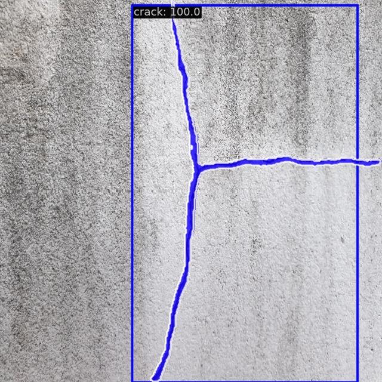

# DamCrack-RSPrompter: Underwater Dam Crack Detection System

[cite_start]This project represents the mid-term milestone of the **National Undergraduate Innovative Training Program** at **Beihang University (BUAA)**[cite: 1, 2]. [cite_start]Focused on the challenges of detecting underwater cracks—characterized by slender geometries, complex backgrounds, and high manual labeling costs—this system leverages the **SAM (Segment Anything Model)** and the **RSPrompter** framework for specialized development.

## 🌟 Project Highlights
* [cite_start]**Automated Prompt Generation**: Overcomes SAM’s reliance on manual interaction by implementing an end-to-end automated segmentation pipeline from image input to crack mask.
* [cite_start]**High-Performance Memory Optimization**: Successfully deployed massive foundation models on a single RTX 4090 (24GB) via **Automated Mixed Precision (AMP)** and RPN proposal pruning.
* [cite_start]**Specialized Anchor Strategy**: Customized anchor ratios of `[0.2, 5.0]` to specifically enhance the capture rate of slender crack structures.

## 📈 Mid-term Experimental Results
[cite_start]The project has successfully completed the first three phases as planned. Latest evaluation metrics on the **DamCrack** dataset are as follows:

| Metric | Best Epoch | mAP Score | Core Value |
| :--- | :--- | :--- | :--- |
| **BBox (Detection)** | 220 | **0.787** | High recall ensuring no structural risks are missed |
| **Segm (Segmentation)** | 275 | **0.328** | Precise topological extraction for quantitative analysis |

### 🖼️ Visualization

> *Figure: `prediction_2363_segm.jpg` demonstrates the model's pixel-level segmentation capability on slender cracks against complex concrete textures.*

## 🛠️ Core Configuration (Config)
Deep optimizations were performed on the `rsprompter_anchor` baseline:
* **Data Pipeline**: Utilizes 1024x1024 high-resolution input to preserve fine crack details.
* **Optimizer**: AdamW with a base learning rate of 0.0001 and `float16` AMP enabled for efficiency.
* **Evaluation System**: Introduced `iou_thrs=[0.05, 0.1, 0.3, 0.5]` to scientifically track progress on extremely thin targets.

## 📂 Model Weights
Following GitHub best practices, large `.pth` files are not stored directly in the repository.
* **Optimal Segmentation Weight (Epoch 275)**: Please download from the [Releases](../../releases) page.

## 🙏 Acknowledgements
This project is developed based on the open-source framework [RSPrompter](https://github.com/KyanChen/RSPrompter). We sincerely thank the author **KyanChen** for the foundational work.

```bibtex
@article{chen2023rsprompter,
  title={RSPrompter: Learning to Prompt for Remote Sensing Instance Segmentation based on Visual Foundation Model},
  author={Chen, Keyan and others},
  journal={arXiv preprint arXiv:2306.16269},
  year={2023}
}
